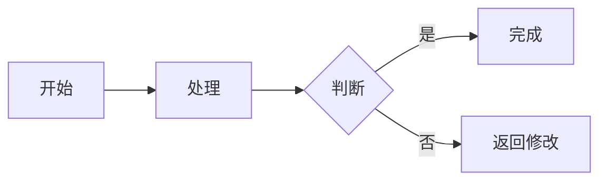

# v0.33.0 — 2026年7月6日

## Wiki 知识库 Mermaid 图表支持

Wiki 页面现已支持 Mermaid 图表渲染，用户可以直接在 Markdown 中编写流程图、时序图、状态图等图表，无需上传图片。

### 新增功能

- **Mermaid 图表渲染**：在 Wiki 页面中使用 ` ```mermaid ` 代码块编写图表，阅读页自动渲染为可视化图表
- **编辑器实时预览**：编辑页实时预览区同步渲染 Mermaid 图表，所见即所得
- **图表源码查看**：支持展开/收起 Mermaid 源码，方便查看和调试语法
- **源码复制**：一键复制 Mermaid 源码文本，便于复用
- **全屏查看**：大型图表支持全屏查看模式，横向/纵向自由滚动
- **主题适配**：图表自动适配浅色/深色主题，保持可读性
- **按需渲染**：多图表页面采用懒加载策略，优化页面性能
- **错误处理**：图表渲染失败时显示错误提示和源码，不影响页面其他内容

### 支持的图表类型

- 流程图（flowchart / graph）
- 时序图（sequenceDiagram）
- 状态图（stateDiagram-v2）
- 类图（classDiagram）
- 实体关系图（erDiagram）
- 甘特图（gantt）
- 饼图（pie）
- Git 图（gitGraph）
- 等更多 Mermaid 支持的图表类型

### 使用示例

在 Wiki 页面中编写：

````markdown

````

阅读页将自动渲染为流程图。

### 技术实现

- 新增前端依赖：`mermaid` v11.x
- 新增组件：`WikiMermaid`、`WikiMarkdown`、`wikiMarkdownComponents`
- 统一阅读页和编辑页 Markdown 渲染逻辑
- 使用严格安全配置（`securityLevel: 'strict'`），确保内容安全
- 支持懒加载和防抖优化，提升多图表页面性能

### 注意事项

- 本版本仅支持在线阅读和编辑预览，导出功能暂不包含 Mermaid 图表转换
- 图表语法需符合 Mermaid 规范，语法错误将显示错误提示
- 建议使用 [Mermaid Live Editor](https://mermaid.live/) 预先验证复杂图表语法
