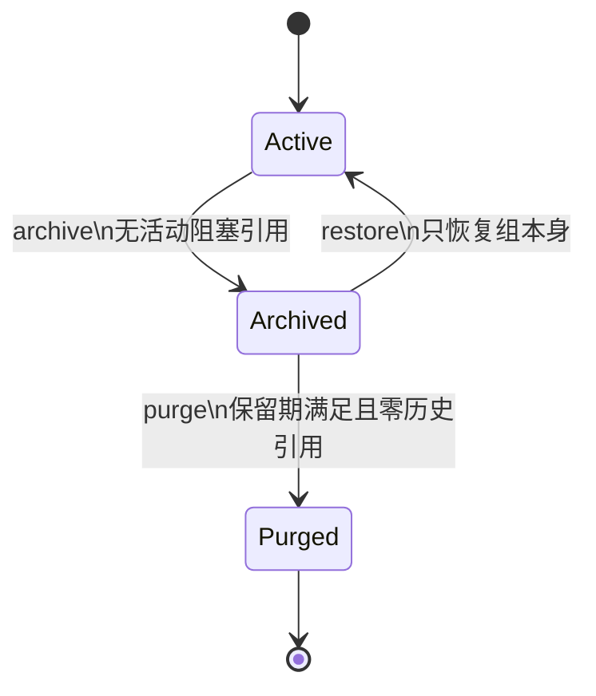

# 可审计用户组生命周期 PRD

## 1. 文档信息

| 属性 | 值 |
|---|---|
| 事件 ID | `REM-P1-001` |
| 产品范围 | 用户组管理 |
| 版本 | v1.0 |
| 状态 | `READY_FOR_IMPLEMENTATION` |
| 创建时间 | 2026-07-14 |
| 关联事件 | `REM-P0-001` |
| 关联关闭项 | `AC-012` |

## 2. 背景

当前用户组管理页面已展示“删除”入口，并向 `/api/groups/{id}` 发送 DELETE 请求，但后端只提供组的列表、创建、编辑和成员增删，不提供生命周期处理。管理员无法通过产品能力清理空组，也无法看到删除为什么失败。

用户组不是孤立对象。它同时承担：

- 用户主组和多组 membership；
- 功能角色的 group scope assignment；
- Wiki、共享文件的 owner group 与 ACL subject；
- 日报和 Workflow group token；
- 设备、凭据和运维任务的数据范围；
- 运维规则、排班、共享文件 `visible_groups` 等逻辑引用。

因此“直接删除一行 group”不是可接受方案。产品需要一套明确、可预检、可撤回、可审计、并能阻止并发脏写的生命周期能力。

## 3. 问题陈述

### 3.1 当前问题

1. 管理员无法通过 UI/API 让一个已不用的组退出活动列表。
2. 删除入口没有引用预检，用户看不到成员、授权、资源或业务对象阻塞原因。
3. 没有归档与恢复语义，误操作无法通过产品能力撤回。
4. 没有 Purge 的严格门禁，未来若直接物理删除可能破坏历史与审计。
5. 没有统一的活动组引用验证，组归档与 membership/assignment/资源写入并发时可能产生指向归档组的新引用。
6. groups `11..15` 已确认属于前序整改测试数据，但无法通过产品能力精确清理，导致 P0 事件清理闭环阻塞。

### 3.2 用户影响

- 管理员只能看到笼统“删除失败”，无法采取可执行的解除动作。
- 组织列表长期积累无效组，影响选择器、报表和后续测试。
- 授权、ACL 和数据范围可能继续引用本应退出的组。
- 测试清理依赖直接 SQL 或人工绕过，无法满足审计与恢复要求。

## 4. 目标

### 4.1 产品目标

1. 管理员可以在 UI 中预检并归档无活动引用的非内置业务组。
2. 被引用的组不能归档，产品必须返回结构化阻塞项和解除建议。
3. 归档操作可审计、幂等、事务原子，并能安全恢复。
4. 已归档组不再出现在活动选择器中，不得参与新授权、新业务写入或运行时权限裁决。
5. 历史日报、已结束任务和审计仍可显示归档组名称，不因归档失去可读性。
6. Purge 只处理达到保留期且零历史引用的归档组，不作为普通删除使用。
7. 通过产品接口归档 groups `11..15`，解除 `REM-P0-001 / AC-012`。

### 4.2 成功标准

- 活动空组归档成功率 100%，归档后活动列表和所有新建选择器不可见。
- 有活动引用的组归档拦截率 100%，无数据变化。
- archive/restore/purge 每次成功操作都有唯一可定位审计记录。
- archive 与新增引用并发测试不产生归档组活动引用。
- groups `11..15` archive 后，`REM-P0-001 / AC-012` 为 PASS。
- 未解释 HTTP 5xx、Console error、后端异常为 0。

## 5. 非目标

- 自动把成员移动到其他组。
- 自动把 assignment、owner group、ACL、设备、日报或任务改到其他组。
- 自动结束 Workflow 或运维任务。
- 自动删除历史日报、审计、Flowable history 或软删除授权关系。
- 用 Purge 清理 groups `11..15`。
- 重构组织层级、嵌套组或多租户模型。
- 修复其他独立的成员列表、权限或模块缺陷。

## 6. 角色与使用场景

| 角色 | 能力 |
|---|---|
| Tenant/Platform 管理员，具有 `group:delete` | 查看 preflight、归档活动 business group |
| Tenant/Platform 管理员，具有 `group:update` | 查看归档列表、恢复归档组 |
| Platform scope 且具有 `group:purge` | 对满足严格条件的归档组执行不可逆 Purge |
| Group scope 操作者 | 不允许 archive、restore 或 purge |
| 普通只读用户 | 只能查看其权限允许的活动组，不看归档操作 |

产品不得依据固定角色名判断以上能力；必须同时校验有效功能 permission、assignment scope/expiry 和当前 authorization mode 的有效裁决。

## 7. 术语与语义

| 术语 | 产品语义 |
|---|---|
| Active | `sys_group.is_deleted=false`，可被选择并参与业务与授权 |
| Archive | 逻辑删除 group；保留记录、历史引用和审计，不允许新引用 |
| Restore | 仅恢复 group 自身为 Active，不恢复旧关系 |
| Delete | UI 文案废弃；原“删除”统一改为“归档” |
| Purge | 物理删除已归档 group，只适用于达到保留期且零历史引用的对象 |
| Active reference | 仍影响身份、权限、访问控制或未结束业务的数据引用 |
| Historical reference | 已结束或已软删除、仅用于展示与追溯的引用 |

## 8. 生命周期

### 8.1 状态规则

- Active 可以更新、添加成员、被分配 scope 和被业务对象引用。
- Archived 只允许查看详情、审计、preflight、restore 或 purge。
- Archived 不允许改名、添加成员、设置主组、创建 assignment、设为 owner/ACL、写入设备/日报/运维对象或 Workflow group token。
- Purged 不可恢复；产品只保留 audit_log 中的不可变快照。

## 9. 核心用户流程

### 9.1 归档成功流程

1. 管理员从首页点击进入“用户组管理”。
2. 点击非内置业务组的“归档”。
3. 系统打开预检弹窗并展示：成员、主组、assignment、资源、ACL、业务对象、Workflow 等引用计数。
4. 所有活动阻塞计数为 0 时，管理员填写 10–500 字原因并输入组名确认。
5. 系统再次在事务内检查引用和版本，归档 group 并写审计。
6. UI 从活动列表移除该组，并可在“已归档”页查看。

### 9.2 被引用阻塞流程

1. 管理员点击“归档”。
2. preflight 显示结构化 blocker，例如“活动 membership 2 条”“Wiki owner 1 个”。
3. 确认按钮不可用；每类 blocker 显示解除建议。
4. 管理员在对应产品模块解除引用后点击“重新检查”。
5. 系统不得自动级联修改或删除 blocker。

### 9.3 恢复流程

1. 管理员进入“已归档”页并点击“恢复”。
2. 系统检查 tenant、权限、group code 冲突和版本。
3. 恢复成功后 group 回到活动列表。
4. 旧 membership、primary group、assignment、ACL、资源 owner 不恢复；UI 明确提示需要重新配置。

### 9.4 Purge 流程

1. Platform scope 操作者进入已归档详情。
2. preflight 显示保留期和全部历史引用。
3. 未达保留期或任一历史引用非 0 时禁止执行。
4. 满足条件后输入原因和组名，系统二次确认“不可恢复”。
5. 事务内重检并物理删除 group，保留 `group_purge` 审计。

## 10. 功能需求

### FR-001 生命周期预检

- 支持 `archive`、`restore`、`purge` 三种 action。
- 返回 group 当前状态、更新时间、允许状态、blockers、active counts、historical counts 和建议动作。
- preflight 只用于展示；执行操作必须重新检查。

### FR-002 Archive

- 仅 Active、非内置、`groupType=business`、同 tenant 的组可归档。
- group scope 操作者禁止归档。
- 归档要求 `group:delete`、原因和精确组名确认。
- 活动 blocker 非 0 返回 409，数据库无变化。
- 成功写入 `isDeleted/deletedAt/deletedBy/updatedAt/updatedBy`。
- 重复 archive 幂等返回 `changed=false`，不得重复写成功审计。

### FR-003 Restore

- 仅 Archived group 可恢复。
- 要求 `group:update`、tenant/platform scope、原因、精确组名和版本确认。
- 活动 code 冲突时返回 409。
- 成功清空删除元数据并写 `group_restore` 审计。
- 不恢复任何历史关系。

### FR-004 Purge

- 新增 `group:purge` permission，只授予产品既有 platform 管理路径。
- 只允许 platform scope 的有效 session。
- 默认归档保留期为 30 天；测试可用隔离配置覆盖为 0，不得直接改生产时间字段。
- 除 `audit_log` 外，所有直接、软删除、逻辑、JSON 和业务历史引用必须为 0。
- 成功后 group 行不存在，`group_purge` 审计仍可查询。
- groups `11..15` 永不走 Purge。

### FR-005 活动/归档列表

- 默认列表只返回 Active。
- 提供“已归档”页签；仅 tenant/platform 管理员可查看。
- 已归档行显示归档时间、归档人和可执行操作。
- 所有组选择器只返回 Active business group；`unassigned` 继续按原合同处理。

### FR-006 历史展示

- 历史日报、已结束运维任务、审计等仍显示归档组名称，并标记“已归档”。
- 历史读取可以查询逻辑删除 group，但不得将其用于授权、选择器或写入校验。

### FR-007 新引用保护

- 所有创建或修改 group reference 的写入口必须验证目标组为同 tenant Active business group。
- 数据库提供并发兜底：archive 与引用写入必须串行化。
- 归档提交后，任何后续写入归档 group 均返回结构化 409/400，不得产生活动引用。

### FR-008 审计

- archive、restore、purge 成功写入独立 action。
- before/after JSON 包含 group 快照、状态、版本和 reference summary。
- remark 包含 10–500 字原因，但不得包含密码、token 或敏感资料。
- 审计插入失败，生命周期操作整体回滚。
- preflight 和被阻塞操作可写诊断日志，但不伪造成功审计。

## 11. Reference 分类

### 11.1 Archive blocker

- group leader 非空；
- 活动 primary user、membership、group assignment；
- DRAFT/SUBMITTED/REJECTED 日报；REJECTED 当前仍可编辑和重新提交，不属于历史终态；
- 活动设备、凭据；
- 未结束运维任务、当前/未来排班、启用且引用该组的运维规则；
- 运行中 Flowable group identity link，以及 Flowable identity membership/privilege mapping；
- 活动 Wiki/共享文件 owner group；
- 活动 resource/wiki/shared ACL group subject；
- 活动共享文件 `visible_groups`；
- 其他仍会影响当前权限、可见性或业务处理的引用。

### 11.2 允许保留的历史引用

- 已软删除 membership 和 assignment；
- APPROVED 日报；
- completed/exception_closed/cancelled 运维任务；
- 已结束 Workflow history；
- audit_log；
- 其他已结束且只用于追溯的记录。

### 11.3 Purge blocker

除 audit_log 外，以上所有活动引用和历史引用都阻止 Purge。数据库外键、非外键 owner/ACL、JSON 引用和软删除行必须全部计数。

## 12. UI 要求

- 将垃圾桶按钮和“确认删除”统一改为“归档”。
- 归档弹窗必须先显示 loading，再显示 preflight，不得先允许确认。
- blockers 使用名称、数量、严重度和解除建议展示，不只显示错误码。
- 原因输入长度 10–500，确认名称必须精确匹配。
- 409 后保留弹窗并刷新 blockers，不关闭弹窗或只 toast“失败”。
- 已归档页签支持查看、恢复；Purge 仅对有权限且 preflight 允许的 platform session 展示。
- 所有新增控件添加稳定 `data-testid`。

## 13. 权限和数据范围

| 操作 | 功能权限 | 最低有效 scope | 资源条件 |
|---|---|---|---|
| 查看活动组 | `group:read` | 按现有合同 | tenant 隔离 |
| 查看已归档组 | `group:read` | tenant | tenant 隔离 |
| Preflight archive | `group:delete` | tenant | 同 tenant group |
| Archive | `group:delete` | tenant | Active business、非内置 |
| Restore | `group:update` | tenant | Archived、无 code 冲突 |
| Preflight/Purge | `group:purge` | platform | Archived、保留期和零引用 |

不得用 `admin`、`super_admin` 等固定角色名代替以上裁决。

## 14. 数据清理目标

功能和回归全部通过后，对 groups `11..15` 执行：

1. 生成操作前快照和产品 preflight。
2. 确认五组活动 blocker 均为 0。
3. 暂停并请求用户明确批准。
4. 通过 archive API 逐个归档，reason 使用本事件 runId。
5. 核对五条审计和软删除三字段。
6. 核对历史 membership/assignment 数量未被改变。
7. 复跑 `REM-P0-001 / AC-012`。

## 15. 发布与回滚

- 先发布数据库引用保护和后端，再发布前端归档入口。
- 不进行全租户模式切换、restore 或历史数据批量迁移。
- 若后端门禁失败，回滚应用并保留未执行的 archive 数据。
- 已归档 group 可以通过 restore API 回退；Purge 不可回滚，因此不进入 groups `11..15` 清理路径。
- 发布候选版仍需执行实时 L4 `275+78`。

## 16. 产品验收

1. 空的非内置 business group 可从 UI 归档，并在归档页可见。
2. 每类活动引用都能精确阻止 archive 并提供可读解除建议。
3. archive/restore/purge 权限和 scope 拒绝均符合 403 合同，数据库无变化。
4. archive 与新增引用并发不产生归档 group 活动引用。
5. 历史记录继续显示组名，但归档组不参与选择和授权。
6. Purge 对未达保留期或任一历史引用返回 409。
7. groups `11..15` archive 后历史关系保持、审计完整、active group 数为 0。
8. `REM-P0-001 / AC-012` 更新为 PASS。
