# 当 Agent 学会了修改自己的说明书：Harness Engineering 实战笔记

> 如果你不是模型，你就是 harness。
> —— LangChain 社区的共识（现已被范畴论证实）

---

我最近花了一整个晚上和一个 AI Agent 聊了一个奇怪的话题——能不能让它自己改自己的"说明书"？

所谓"说明书"，就是那些 skills 文件、review 标准、task 粒度规则、TDD 强制门禁。这些东西合在一起，学术界给了一个名字：**harness**——连接 LLM 和执行环境的软件层。它决定了 Agent 的行为边界，就像飞行员的 checklist 决定了飞行安全。

我读了五篇论文（确切说是四篇半，preprints.org 那道 403 墙我还没翻过去），然后和我的 Agent 一起设计了一套方案。下面是完整记录。

---

## 一个被忽视的事实：你的 Agent 比你以为的更笨

先坦白一个尴尬的实验结果。

论文 *Harness Engineering as Categorical Architecture* 的作者用两个 8B 模型（Gemma 4 和 DeepSeek-R1）在 SWE-bench-lite 上跑代码修复。10 个实例，两种模型，三种 harness 配置（baseline / organism / LangGraph），总共 30 次提交。

结果：**0 个通过。**

不是因为模型不会修 bug，而是因为模型**产出的 diff 格式不对**。26/30 的提交连 diff 形状都没有。不是 "修错了"，是 "根本没产出可用的东西"。

这个实验结果被作者诚实地写进了论文——不是为了自嘲，而是为了证明一个关键论点：

> **在 8B 这个量级，模型的格式纪律（format discipline）是天花板，不是文件选择、不是检索质量、不是 prompt 工程。而且换了训练范式（instruction-tuned → reasoning-distilled），天花板依然在那里。**

我讲这个故事不是为了嘲笑小模型。我想让你感受一下：当你的 Agent "不听话"时，你骂模型、换模型、调 prompt，都没用——**真正的瓶颈可能在 harness 层**。

---

## 什么是 Harness？为什么它比模型更重要？

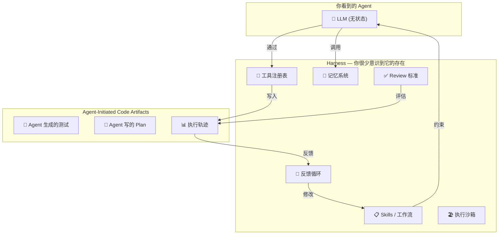

*图：Harness 不是 LLM 外面的壳，它是 LLM 的手脚和神经系统。没有它，LLM 只是一个会说话的文本框。*

论文 *Code as Agent Harness* 把问题精确地分成了三层：

1. **Harness Interface** — 代码怎么成为 Agent 的"语言"。不只是输出，是推理、行动、环境感知的介质。
2. **Harness Mechanisms** — 规划、记忆、工具、控制、反馈。让 Agent 在 100 步之后不迷失。
3. **Scaling the Harness** — 多 Agent 怎么通过共享的代码工件协作。manager / planner / coder / reviewer / tester 各司其职。

而我用的 Superpowers（22 个开发 workflow skill）和 Garry Tan 的 gstack（23 个虚拟专家），本质上都是这三种东西的组合。只是 gstack 有 `/cso` 做安全审查，Superpowers 有 `<HARD-GATE>` 阻止你跳过步骤——风格不同，结构相同。

---

## 第二个被忽视的事实：你选的 harness 可能一开始就是错的

来看看一个真实数据。

我的项目 `cwgsyw-platform` 是一个中大型全栈系统，GitNexus 索引告诉我它有：

- 3419 个符号
- 6972 个关系
- 285 个执行流
- 12 个功能模块（changedoc、cmdb、ui、rbac、auth……）

我对比了 gstack 和 Superpowers 两种 harness 方案：

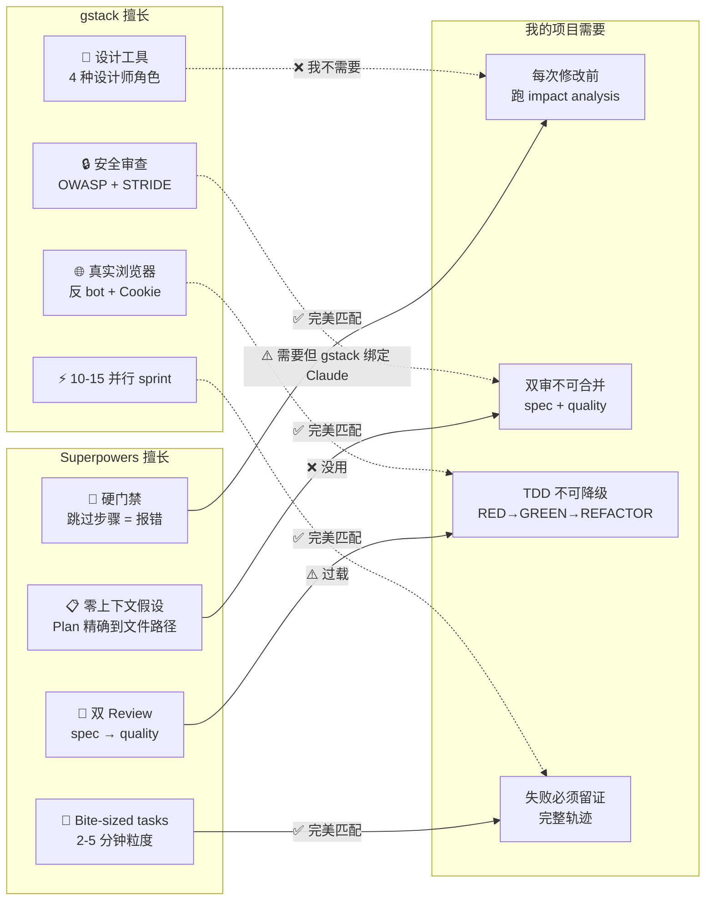

**结论**：Superpowers 的硬门禁和双审流程天然匹配我的项目约束，而 gstack 最擅长的设计工具链和浏览器测试对我基本没用。

但你猜怎么着？**这个"选哪个更好"的问题本身就是错的。**

---

## 真正的问题：Harness 需要自我演化

论文 *Meta-Harness* 的作者 Yoonho Lee 做了这样一个实验：

给一个 coding agent（Claude Code）一个**文件系统**，里面是所有历史候选 harness 的完整源代码、执行轨迹、评估分数。然后让它读这些日志，**自己提出新的 harness**。

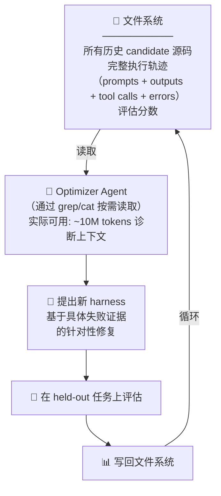

**结果震撼**：

| 指标 | 传统方法 | Meta-Harness |
|------|---------|-------------|
| 优化器看到的上下文 | ~26K tokens | **~10M tokens**（400×） |
| 文本分类提升 | 基线 | **+7.7 到 +9 个百分点** |
| 编程任务提升 | 28.5% | **40.6%（+12.1）** |
| 评估次数 | 基线 | **10× 更少** |

**为什么文件系统比总结好？**

传统 harness 优化方法只给 optimizer 一个分数、一段摘要、几个示例。Optimizer 知道"这个 harness 分数低"，但不知道**为什么低**。它只能猜。

Meta-Harness 给 optimizer 完整执行轨迹——哪次 tool call 超时了、哪个 review 报了假阳性、哪个 task 因为上下文膨胀失败了。Optimizer 通过 grep 精准定位到具体的 harness 决策，然后修复它。

这和你 debug 代码一模一样——你不会只看测试通过率，你要看日志。

---

## 但 Meta-Harness 漏了一个关键环节

Meta-Harness 用文件系统做优化上下文。这比摘要好 100 倍。但它有一个盲点：**文件系统是被动的**。

你需要 optimizer 主动 grep 查找信息。Optimizer 必须知道自己要查什么。但如果失败模式是 optimizer 不知道的新型失败呢？

在我的项目里，我已经有了一个更好的东西：**Honcho 记忆系统**。

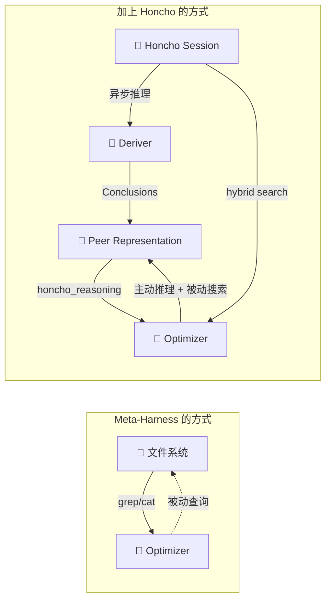

**Honcho 不只是存储，它在后台自动推理。**

每次 task 执行完，轨迹写入 Honcho。Deriver 异步处理——它用形式逻辑从对话中提取显式陈述 + 演绎推理 + 归纳推理 + 溯因推理：

- "spec review 在 changedoc 模块的 task 中连续失败了 3 次"
- "所有失败都指向同一个原因——缺少 GitNexus impact analysis"
- "quality review 反复指出 test 缺少边界条件——这可能是 skill 的 task 粒度问题"

**这些结论不是你或者 optimizer 手动发现的——是 Honcho 在你睡着的时候自动提取的。**

当 optimizer agent 触发时，它不需要从零读日志。直接问 Honcho：

```
honcho_reasoning("过去 20 个 task 中，harness 的哪些设计决策导致了最多的失败？")
honcho_search("TDD 被跳过 AND 后续集成测试失败")
```

Honcho 已经做了"理解轨迹"的苦力活，optimizer 只需要做"提出修改"的创造性工作。

---

## 第四篇论文给了我们一个框架

论文 *Harness Engineering as Categorical Architecture* 提出了一个让我拍大腿的框架。它说 harness 不是一个"大杂烩"，而是一个有数学结构的东西：

```
Architecture Triple: A = (G, Know, Φ)

G   = 语法接线图（模块 + 端口 + 信息流向）
Know = 结构保证（证书——可验证的质量断言）
Φ   = 部署映射（抽象能力 → 具体模型选择）
```

**最关键的创新**：论文把结构保证形式化为"证书"（Certificate），并证明**证书是 harness 级别的属性，不绑定到任何特定模型**。

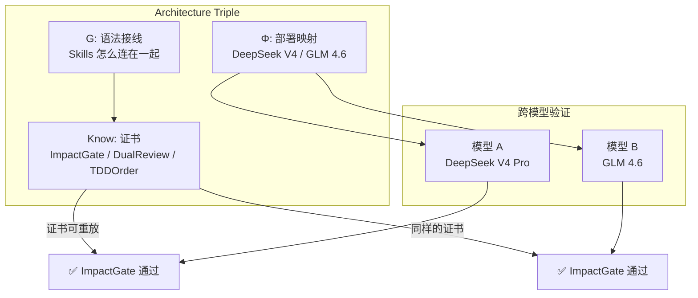

换模型不换 harness。证书是"每次改动前必须跑 impact analysis 吗？"，这和你用 DeepSeek 还是 GLM 没关系。

**这个框架直接给了我一套防止 harness 漂移的方法。**

---

## 防止 Agent 自己把自己改坏：三层约束

没有约束的优化就是漂移。Optimizer 会说"impact analysis 太慢了，建议跳过"——你同意了，然后下次改动炸了一片。

我把约束设计成三层：

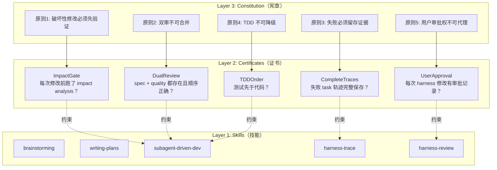

**宪章是你定的**，几乎不修改。**证书是从宪章派生的、可自动验证的断言**。**Skills 是 optimizer 可以自由优化的**——只要不破坏证书。

这样 optimizer 的搜索空间被精确限定：它可以在"不违反双审原则"的前提下优化 review 的 prompt；可以在"不跳过 TDD"的前提下调整 task 粒度。但不能提议"让我们跳过 impact analysis 加速流程"——因为 ImpactGate 证书会立刻失效。

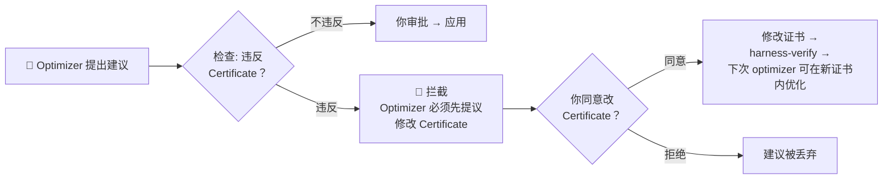

---

## Honcho 在整个循环中的四个角色

我花了一个晚上配置 Honcho 的 deriver（中间踩了七层坑——OpenAI API key 指向了 DeepSeek、thinking_effort 被 DeepSeek 拒绝、json_schema 不支持、token 阈值太高不触发处理……这些我有另外一篇血泪史），最终把 Honcho 变成了 harness 优化的基础设施：

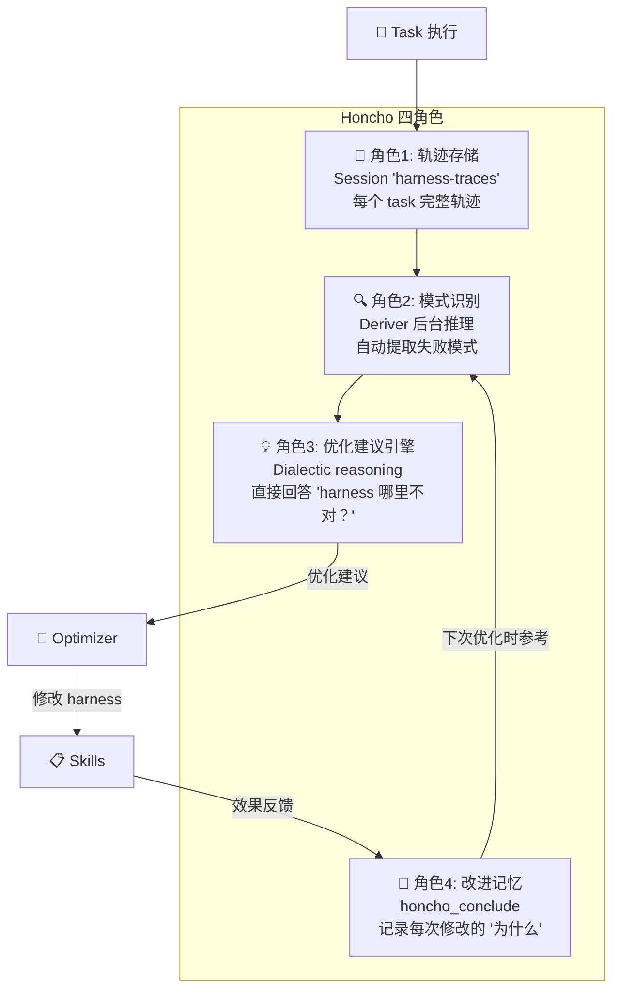

**角色 1 — 轨迹存储**：每次 `delegate_task` 完成后，完整 context + execution + review 结果 + 测试输出写入 Honcho session。不存在"日志丢了"的问题——Honcho 的 hybrid search 随时随地能搜到。

**角色 2 — 模式识别（最关键的差异）**：Deriver 在后台异步处理这些轨迹。它用形式逻辑提取结论。不是关键词匹配，是真正的推理——"这三个失败表面上看不同，但它们共享同一个根因"。

**角色 3 — 优化建议引擎**：当 harness-review 触发时，optimizer 不需要从零读日志。Honcho 已经提取了结论——optimizer 直接问 Honcho："过去 20 个 task 的 harness 级别失败模式是什么？"然后基于答案提出改进。

**角色 4 — 改进记忆**：每次 harness 修改后，用 `honcho_conclude` 记录"为什么改？效果如何？"。不是无结构的 git commit message，而是一条持久化的结论："将 writing-plans 的 task 粒度从 2-5 分钟收紧到 2-3 分钟，因为 changedoc 模块的 task 经常超时导致上下文膨胀。修改后 5 个 task 的 review 通过率从 60% 提升到 100%。"

---

## 完整的数据流：从 Task 执行到 Harness 演化

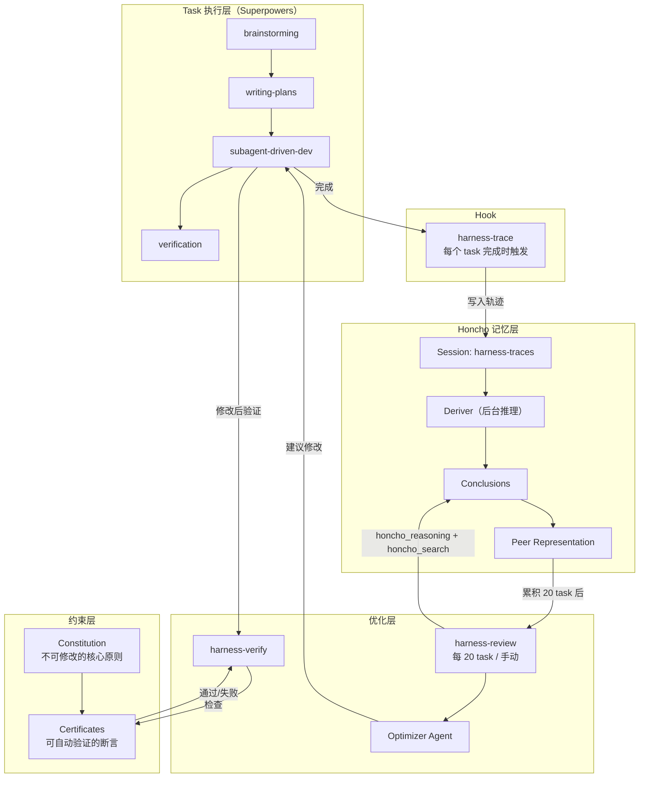

---

## 防止漂移的完整机制

Optimizer agent 在启动时，它的 system prompt 会加载当前所有证书：

```
你是 harness optimizer。你可以自由修改 skills、调整粒度、优化 review。
但你绝对不能提出违反 Certificate 的建议。

当前 Certificate:
• ImpactGate: 每次代码修改前必须运行 gitnexus_impact()
• DualReview: spec 和 quality review 必须独立、顺序正确
• TDDOrder: 测试必须比代码先写
• CompleteTraces: 失败 task 轨迹必须保存到 Honcho
• UserApproval: 每次修改必须有用户审批记录

如果你认为某个 Certificate 本身需要修改——先提议修改 Certificate。
Certificate 修改和 Skill 修改是两个独立流程，不能合并。
```

这样漂移的防护不是"禁止修改"，而是**"想改约束？先改约束本身，改完了再谈优化。"**

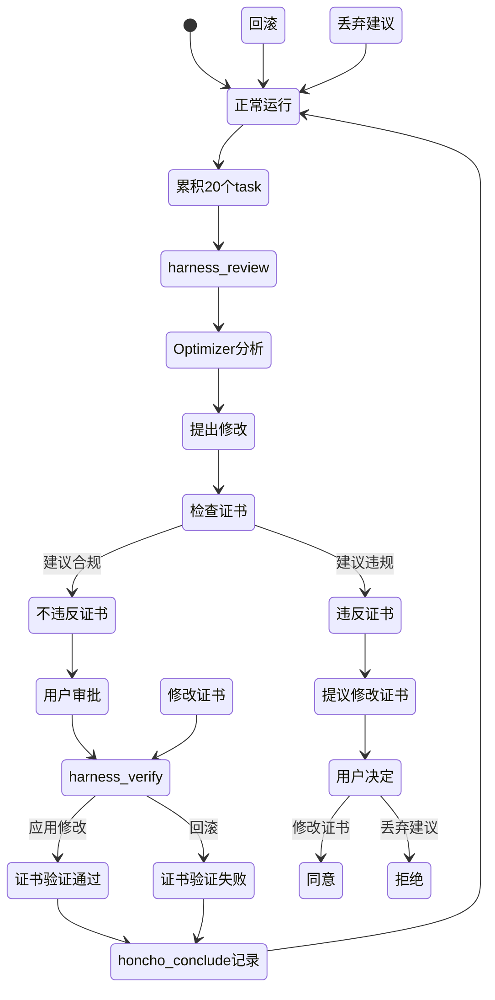

---

## Agent-Initiated Code Artifacts：被忽视的宝藏

论文 *Code as Agent Harness* 指出，Agent 在任务循环中创建的东西——测试代码、plan 文件、执行轨迹、临时工具——本身就是 harness 的一部分。它们不是垃圾，是**可复用的代码工件**。

在我的设计中，这些东西被系统地保存到 Honcho：

- **Agent 生成的测试** → 作为回归测试保留，加入测试套件
- **Agent 写的 plan 文件** → 作为"这个 feature 是怎么做的"的知识库
- **执行轨迹** → 作为 harness 优化的诊断数据
- **Agent 提出的 harness 修改** → 作为 harness 演化历史

下次 harness-review 时，optimizer 不仅能看到"改了 harness 后 task 通过率提升了"，还能看到"Agent 在 harness 修改后生成的测试质量也提升了"——这是 meta 级别的反馈。

---

## 模型参数化：换模型不换约束

Architecture Triple 的 Φ（部署映射）告诉你：**harness 和模型是解耦的**。

我的 Honcho deriver 从 DeepSeek V4 Pro 换到 GLM 4.6（因为 DeepSeek 不支持 json_schema 结构化输出），花费了一整晚调试。但 harness 的证书——ImpactGate、DualReview、TDDOrder——不受影响。

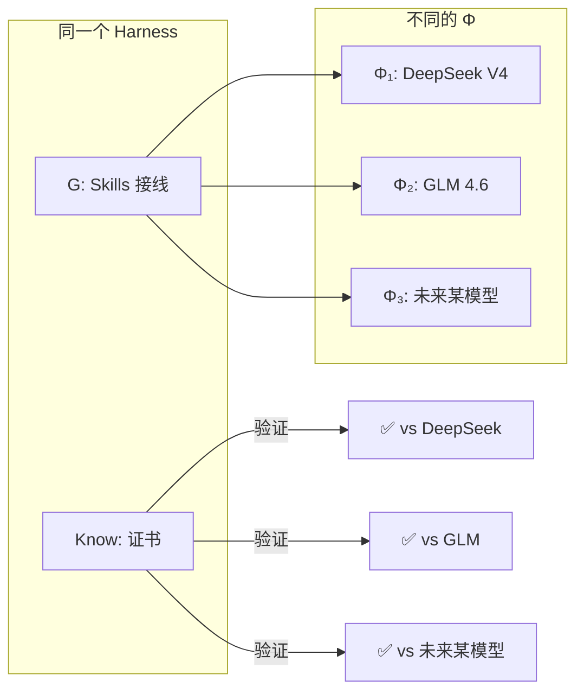

这是论文的核心主张之一——结构保证不是"这个模型跑出来的结果好"（那是模型评估），而是"这个 harness 的流程有没有坏死"（那是 harness 级别的属性）。

---

## 五层框架全景图

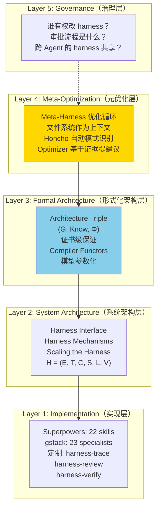

当前 gstack 和 Superpowers 都只覆盖了 Layer 1-2。Layer 3-5 是这篇论文集的贡献——也是我的设计试图填补的空白。

---

## 写在最后：Agent 学会了修改说明书之后

我花了一个晚上和一个 Agent 讨论——它能不能自己改自己的说明书？

答案是：**可以，但需要三层约束**。

1. **Constitution 说"什么不能改"**——你定义底线。
2. **Certificates 说"怎么验证没越界"**——Honcho 自动检查。
3. **Skills 是"可以改的地方"**——Optimizer 在证书允许的范围内自由优化。

Honcho 不是被动数据库——它是这个循环的推理引擎。它在后台自动提取模式、识别失败根因、生成优化建议。Optimizer 只需要做最后一跃：提出修改。

这不是科幻。Meta-Harness 用文件系统做到了 10M tokens 诊断上下文。我加上 Honcho 之后，不需要 optimizer 读 10M tokens——它读 Honcho 已经提取好的结论就够了。

**当你下次发现 Agent 反复犯同一个错误时——不要换模型。看看是不是你的说明书该改了。**

---

## 参考文献

1. "Code as Agent Harness" — arXiv 2605.18747
2. "Harness Engineering for Language Agents" — preprints.org 202603.1756（Meng et al., 6元组形式化, 110+ papers）
3. "Meta-Harness: End-To-End Optimization of Model Harnesses" — Yoonho Lee et al.
4. "Harness Engineering as Categorical Architecture" — arXiv 2605.12239（Architecture Triple, Operon framework）
5. "Adaptive Auto-Harness" — arXiv 2606.01770
6. "Externalization in LLM Agents" — Zhou et al., arXiv 2604.08224
7. "Scaling Coding Agents via Atomic Skills" — Ma et al., arXiv 2604.05013
8. Superpowers — github.com/obra/superpowers, adapted for Hermes Agent
9. gstack — github.com/garrytan/gstack
10. Honcho — github.com/plastic-labs/honcho
